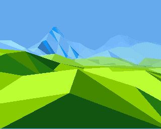

# Snowscape

### Description
A small terrain engine for Acorn Archimedes inspired by the Midwinter series of games by Mike Singleton and Maelstrom. These games never came out on the Acorn  series of machines, so this was just a fun project to imagine what it might have looked like on the Archimedes utilizing it's slightly quirky 256-color palette. Written in C89 and ARM assembly. Utilizes the [C89 dynamic array](https://github.com/eteran/c-vector) by Evan Teran.

I haven't looked fully at either the 68k or x86 DOS dissassembly for Midwinter, and aside from the articles in magazines of the midpoint displacement method for terrain generation, **assume this to have little or no connection to how Maelstrom originally implemented the engine in Midwinter**.

As per the license this software is released **AS IS**. I don't have the time to look through pull requests, etc., but please feel free to fork the project and play with it as you will. :)

Click on the image for a YouTube recording in Arculator\

### QuickStart and Controls
Thanks to the amazing [Archimedes Live!](https://archi.medes.live/) you can run a prebuilt version directly in the browser.

[SnowScape A5000 Version](https://archi.medes.live#preset=a5000&ff=14400&disc=https://raw.githubusercontent.com/arkiruthis/snowscape/76909172634979cdaf4dc8cd4e31dbfa24f17d27/Images/snowscapeA5000.adf&autoboot=desktop%20filer_run%20adfs::0.$.!Snowscape) (further draw distance)\
[SnowScape A3020 Version](https://archi.medes.live#preset=a3020&ff=14400&disc=https://raw.githubusercontent.com/arkiruthis/snowscape/76909172634979cdaf4dc8cd4e31dbfa24f17d27/Images/snowscapeA3020.adf&autoboot=desktop%20filer_run%20adfs::0.$.!Snowscape) 

#### Controls
LEFT CLICK - Move forwards\
RIGHT CLICK - Move backwards\
MOUSE - Move view\
ESCAPE - Return to RISCOS

### Known Issues
- Very large triangles close to the camera corrupt in the view. This is because the DY required to calculate the gradient is larger than the reciprocal multiplication lookup, so the routine keeps halfing DX and DY until it fits. This results in harsh gradient inaccuracy. TODO - We can jump to a dedicated divide routine to fix this (which Zarch, etc. does). 
- When you reach the edge of the terrain, you'll be abruptly reset to the starting position. TODO - like the original Midwinter, we could reset the camera and generate the terrain to match the next section you're in. 
- Performance could probably be improved by moving more C into ARM assembly... but it's worth playing the original Midwinter on a stock STFM or A500 as a reminder of the original framerate... :P 
- Why is there a blue line at the bottom? Because when I draw there I get a stack heap corruption on exit. 😱 It'll be something trivial, it always is... 

### Building Prerequisites
- RPCEmu or Arculator
- Acorn C++ / DDE 
  - Modern DDE with (32bit C99 support and more) available from [RiscOS Open](https://riscosopen.org/content/sales/dde)
  - Last major release (26bit C89 support) is included in the [RPCEmu Easy-Start bundle](https://www.marutan.net/rpcemu/index.php)

### Building
1. Checkout the repo and copy (or ideally, symlink for ease of development) the `Project` folder into your `hostfs` folder for your emulator.
2. Ensure the build tools are available. (i.e., run `$HostFS::HostFS.$.AcornC_C++.!SetPaths`)
3. Open the Projects folder.
4. Double-click the Makefile to generate the `!MeshRenderer` executable.
5. Run the generated `!Run` script (which sets some environment variables) to launch.

### Building for lower-end Archimedes (A3000/A3010/A3020)
Remove the A5000 define from the CC flags in the Makefile (i.e., the `-DA5000` on the `CCflags` section near the top). This will use a smaller grid to render.

### Running on Original Hardware
Use an emulator (Arculator, RPCEmu, ArchiEmu, etc.) to copy the Projects folder onto an ADF and either use that in a Gotek, or use it to prepare a floppy disk. This is to preserve the file types that are set up on HostFS so that they run correctly on native RISCOS. 

### Enabling Profiling
1. Uncomment `// #define TIMING_LOG 1` in `/Projects/h/Render`
2. Uncomment `| Run <Obey$Dir>.TimerMod` in the `/Projects/!Run` script.
3. Download [TimerMod](https://armclub.org.uk/free/) and unpack into in the `/Projects` folder.
4. Rebuild and Run.

### Scripts
- The scripts folder contains a NodeJS script which is used to take the exported Archimedes palette (a list of RGB hex numbers) and generate a lookup table. It does this as a PNG first, because of the limited options, it doesn't always get the gradients looking nice, so we can tweak the table a bit before turning it into the binary lookup which is used by the engine in the /assets folder. 

### Grateful Thanks and Shoutouts
The Maelstrom team (particularly in memory of [Mike Singleton](https://en.wikipedia.org/wiki/Mike_Singleton)), whos incredible games made a little me believe whole worlds could exist in a small home computer!

David Ruck for his superb [TimerMod](https://armclub.org.uk/free/) utility which is available from his site which made profiling many of the routines far easier.

The amazing [Bitshifters](https://bitshifters.github.io/index.html) team for always being generous with their knowledge and pushing the Archimedes and BBC Micro to it's limits with their amazing demos!

Tom Sneddon for helping me fix the CORS issue which means we can link to Archimedes Live! direct from here. Also check out `b2`, his amazing [BBC Micro Emulator](https://github.com/tom-seddon/b2)! 
